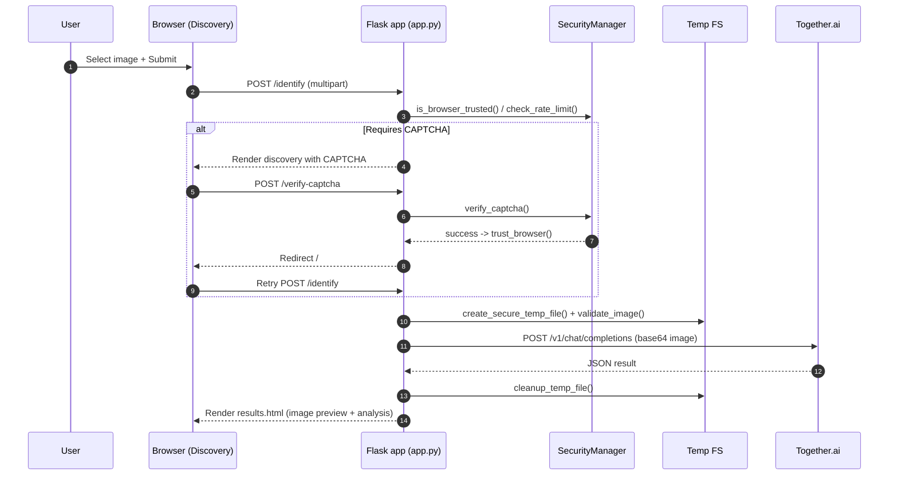

## WildID Visual System Diagrams

### Architecture Overview
```mermaid
graph TD
  subgraph Client
    A[Browser]
    TPL[Templates: index.html, discovery.html, results.html, map.html]
    STA[Static: css/style.css, js/app.js]
    LFC[Leaflet CDN]
  end

  subgraph Server[Flask App (app.py)]
    R1[Routes: /, /discovery, /identify, /map, /api/*, /health]
    SM[SecurityManager (security.py)]
    HD[get_animal_habitat_data]
    LOG[Logging -> app.log + stdout]
  end

  FS[(Temp Files: uploads/ + tempfile)]
  TOG[Together.ai API\nQwen2.5-VL-72B-Instruct]

  A -->|HTTP| R1
  TPL --> A
  STA --> A
  LFC --> A

  R1 --> SM
  R1 --> FS
  R1 --> TOG
  R1 --> HD
  R1 --> LOG
  SM --> R1
  FS --> R1
```

### Upload-to-Result Sequence


### Deployment Topology
```mermaid
graph LR
  subgraph Local Dev (Docker Compose)
    D1[Service turtle-identifier-dev\npython app.py]
    V1[(./uploads -> /app/uploads)]
    D1 --- V1
  end

  subgraph Production (Docker Compose)
    P1[Service turtle-identifier]
    V2[(./uploads -> /app/uploads)]
    HC1[/Healthcheck: GET /health/]
    P1 --- V2
    P1 --- HC1
  end

  subgraph Kubernetes (POC bridge/)
    NS[Namespace proof-of-concept-demo]
    DEP[Deployment turtle-identifier]
    SVC[Service turtle-identifier]
    LBSVC[Service turtle-identifier-published\n(type: LoadBalancer)]
    PVC[PersistentVolumeClaim uploads]
    NS --- DEP
    DEP --- PVC
    DEP --> SVC
    SVC --> LBSVC
  end
```

### Security Flow (Rate Limit + CAPTCHA)
```mermaid
flowchart TD
  A[Start: Request to /identify] --> B{Browser trusted?}
  B -- Yes --> C[Proceed]
  B -- No --> D{Exceeded rate limit?}
  D -- No --> C
  D -- Yes --> E[Generate CAPTCHA\nRender discovery]
  E --> F[POST /verify-captcha\n(captcha_id, answer)]
  F --> G{Valid + not expired +\n fingerprint matches?}
  G -- No --> E
  G -- Yes --> H[trust_browser() 30 days]
  H --> C
  C --> I[Validate file type/size]
  I --> J[Create secure temp file]
  J --> K[Analyze via Together.ai]
  K --> L[Render results + cleanup]
  L --> M[record_request()]
```

Notes
- View these diagrams natively in editors that support Mermaid (e.g., GitHub, VS Code with Mermaid preview, MkDocs with mermaid2 plugin).
- Kubernetes manifests under `bridge/` contain placeholder Windows path artifacts and a hardcoded key in the POC; sanitize for real deployments.
